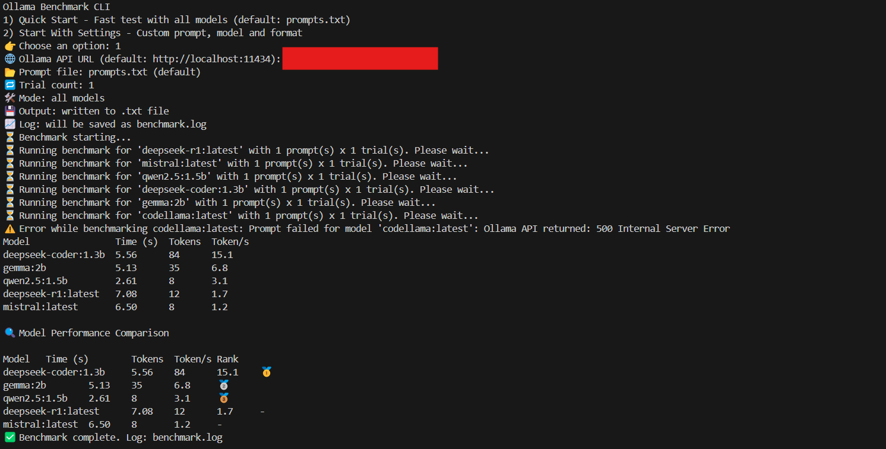
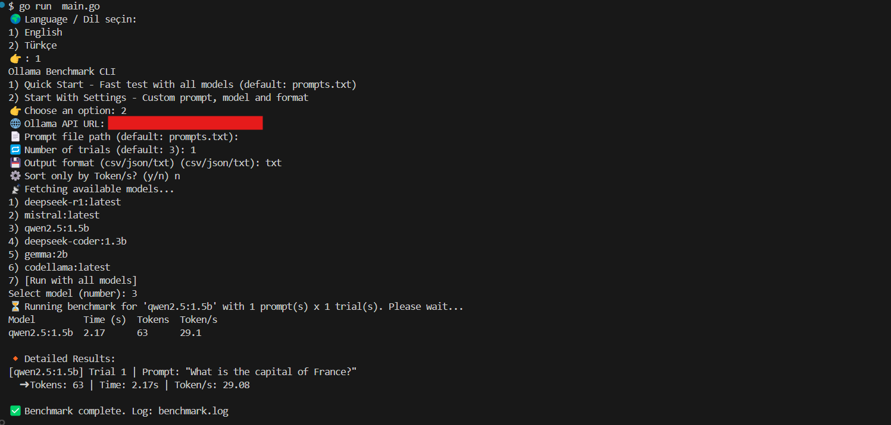

#  🎢 Ollama Benchmark CLI

  

A command-line tool for evaluating and comparing local LLM models using custom prompts and source code inputs. Ideal for developers testing model quality and performance in real-world scenarios.

## 🖼️ Screenshots





## 🚀 Features

- Multi-model benchmarking (Mistral, DeepSeek, Phi, etc.)

- Detailed results with export support

- Supports JSON, TXT and comparison formats

- Multi-language interface (English & Turkish)

- Docker-ready for easy deployment
  

## 🐳 Run with Docker

```bash
# Build the Docker image
docker  build  -t  ollama-benchmark  .
```

```bash
# Run the CLI tool
docker run -it --rm \
  -v $PWD/output:/root/output \
  -v $PWD/prompts.txt:/root/prompts.txt \
  ollama-benchmark
```
> Benchmark results will be saved inside the `output/` directory.


## 💻 Run without Docker
You can also run the CLI tool directly on your machine.
### On Windows:
```bash
go build -o ollama-benchmark.exe main.go
ollama-benchmark.exe
```
### On Linux:
```bash
go build -o ollama-benchmark main.go
./ollama-benchmark
```
Make sure **prompts.txt** and **internal/i18n/lang.json** files are present in the correct location.

## 🚀 Parameters

You can pass options like this:
```bash
ollama-benchmark --model mistral --input code.py --lang en
```


## 📁 Project Structure

-   `internal/` → Source code
    
-   `prompts.txt` → Prompt input list
    
-   `output/` → Benchmark output directory
    
-   `main.go` → CLI entry point


## 🧑‍💻 Development

-   Requires Go 1.21+
-   Fully containerized with Docker
-   Designed for extensibility and easy testing


## 🤝 Contributing

Feel free to open issues or pull requests for feature requests or improvements.

## 📜 License

MIT License


## 🧑‍💻 How to Use

When you run the CLI, you will be prompted to select a language and then choose between: 
1) Quick Start 
2) Custom Settings

### ⚡ 1. Quick Start Mode
The fastest way to run benchmarks using default values.
- Uses default Ollama API URL: http://localhost:11434
- Loads prompts from: prompts.txt
- Runs each model once (1 trial)
- Outputs results in .txt format
- Shows results as table and logs performance

**How to run (after Docker build):**
```bash
docker run -it --rm \
  -v $PWD/output:/root/output \
  -v $PWD/prompts.txt:/root/prompts.txt \
  ollama-benchmark
```


### ⚙️ 2. Custom Settings Mode
Allows fine-tuning the benchmark process. You'll be prompted for:
-   Ollama API URL
-   Prompt file path (default: `prompts.txt`)
-   Number of trials (default: 3)
-   Output format (`csv`, `json`, or `txt`)
-   Tokens-only view? (`y/n`)
-   Model selection (single or all)

Each model will be tested multiple times and results will be saved accordingly.

### 📊 Output Files
- benchmark_summary_result_<timestamp> : All benchmark results summary

- benchmark_detail_<model>_<timestamp> : Per-model detailed results

- benchmark_summary_comparison_<timestamp> : Multi-model comparison (if >1 used)

- performance.log : Internal performance log (append)

All outputs are saved inside the /output folder.

### 📌 CLI Logic Summary
-   Language support: English & Turkish
-   Interactive terminal input
-   Benchmark logic: via **internal/benchmark**
-   Model list fetched from local Ollama API
-   Prompt source: plain text (**prompts.txt**, line by line)
-   Modular output system (**csv, json, txt**, comparison)